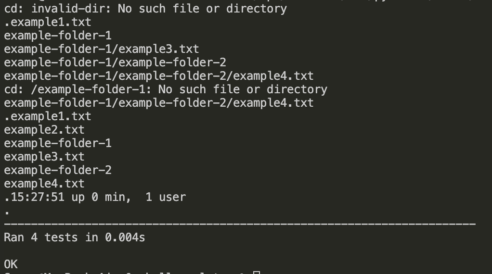

# Эмулятор для языка оболочки ОС

## Общее описание

В данной работе был разработан эмулятор для языка оболочки ОС. Эмулятор запускается из реальной командной строки, а файл с
виртуальной файловой системой не нужно распаковывать у пользователя. Эмулятор принимает образ виртуальной файловой системы в виде файла формата tar. Эмулятор работает в режиме CLI.

Конфигурационный файл имеет формат ini и содержит:
* Имя компьютера для показа в приглашении к вводу
* Путь к архиву виртуальной файловой системы
* Путь к лог-файлу
* Путь к стартовому скрипту

Лог-файл имеет формат json и содержит все действия во время последнего сеанса работы с эмулятором.

Стартовый скрипт служит для начального выполнения заданного списка команд из файла.

Эмулятор поддерживает следующие команды:
1. ls
2. cd
3. exit
4. find
5. uptime

## Описание функций

### Методы класса ShellEmulator

1. \_\_init\_\_(self, config_path): Это конструктор, который инициализирует эмулятор с путем к конфигурационному файлу. Он настраивает имя хоста, виртуальные файлы, лог-файл, стартовый скрипт, текущую директорию и механизм ведения логов на основе предоставленной конфигурации.

2. load_config(self, config_path): Этот метод загружает конфигурацию из указанного файла по пути config_path. Он читает конфигурационный файл и возвращает словарь с параметрами: имя хоста, архивный файл (tar файл), лог-файл и стартовый скрипт.

3. load_tar(self, tar_path): Этот метод загружает содержимое .tar файла (архив виртуальных файлов) в память. Он использует модуль tarfile из Python и возвращает словарь, где ключами являются имена файлов, а значениями — файлы из архива.

4. execute_command(self, command): Этот метод обрабатывает и выполняет команды. Команда, которая не распознана, выводит сообщение "command not found" (команда не найдена). Поддерживаются следующие команды:

* cd <путь>: смена директории
* ls: вывод содержимого директории
* exit: выход из оболочки
* find <имя файла>: поиск файла в виртуальной файловой системе
* uptime: отображение времени работы системы

5. change_directory(self, path): Обрабатывает команду cd (смена директории). Может перейти в корневую директорию (/), родительскую (..) или в указанный путь, если он существует в виртуальной файловой системе. Метод также ведет лог действий и обновляет текущую директорию.

6. list_directory(self): Этот метод выполняет команду ls, которая выводит содержимое текущей директории. Он фильтрует виртуальные файлы, чтобы показать только те, которые находятся в текущей директории. Также логирует действие и возвращает содержимое директории.

7. find_file(self, filename): Реализует команду find <имя файла>. Метод ищет файлы в текущей директории, которые соответствуют указанному имени. Если файлы найдены, они отображаются; если нет, выводится сообщение "No such file or directory" (нет такого файла или директории). Действие логируется.

8. show_uptime(self): Этот метод выполняет команду uptime, которая отображает время работы системы с момента запуска оболочки. Он вычисляет разницу между текущим временем и временем запуска оболочки. Результат форматируется и логируется.

9. exit_shell(self): Обрабатывает команду exit, которая завершает работу оболочки. Логирует действие и завершает программу.

10. log_action(self, action, result): Вспомогательный метод для ведения лога любых выполненных команд оболочки. Он добавляет каждое действие и его результат в лог и записывает лог в файл в формате JSON.

11. run_start_script(self): Выполняет стартовый скрипт, который указан в конфигурации. Метод построчно читает скрипт и выполняет каждую команду. Если скрипт не найден, выводится сообщение об этом.

12. run(self): Это основной цикл работы эмулятора. Сначала выполняется стартовый скрипт, а затем программа переходит в цикл ожидания пользовательских команд, выполняя их по мере ввода.

## Примеры использования

## Результаты прогона тестов

